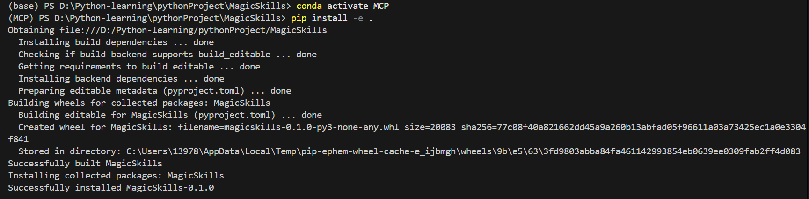
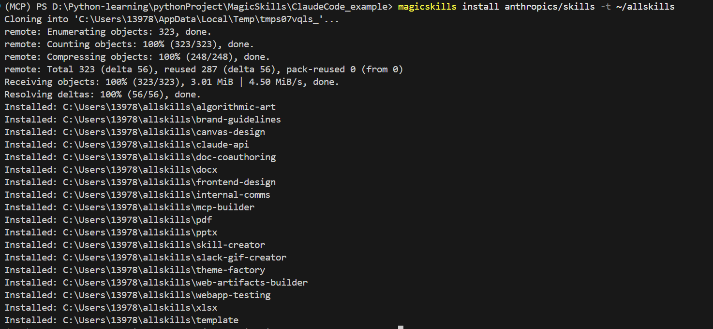

# Claude Code

## Claude Code启动

## 安装magicskills

首先 `git clone https://github.com/Narwhal-Lab/MagicSkills.git`

并执行  `pip install -e .` 指令



本文的示例 skill 以 **`docx`** 为例


### 安装 skill(之前已经下载过的可以选择跳过)

执行 `magicskills install anthropics/skills -t ~/allskills`




### 创建skills

执行 `magicskills createskills claudecode --skill-list docx --agent-md-path ./AGENTS.md`

### 生成 AGETNS.md

执行 `magicskills syncskills claudecode --output ./AGENTS.md -y` 指定输出AGENTS.md路径，不指定时候就默认用`createskills`指定的`--agent-md-path ./AGENTS.md`
此时AGENTS.md会出现如下内容

```markdown
# AGENTS

<skills_system priority="1">

## Available Skills

<!-- SKILLS_TABLE_START -->
<usage>
When users ask you to perform tasks, check if any of the available skills below can help complete the task more effectively.

How to use skills:
Unified skill cli. If you are not sure, you can first use "magicskills listskill" to search for available skills. Then, determine which skill might be the most useful. After that, try to use "magicskills readskill <path>" to read the SKILL.md file under this skill path to get more detailed information. Finally, based on the content of this file, decide whether to read the documentation in other paths or use "magicskills execskill <command>" to directly execute the relevant script.

Usage notes:
- Only use skills listed in <available_skills> below
- Do not invoke a skill that is already loaded in your context
</usage>

<available_skills>

<skill>
<name>pdf</name>
<description>Use this skill whenever the user wants to do anything with PDF files. This includes reading or extracting text/tables from PDFs, combining or merging multiple PDFs into one, splitting PDFs apart, rotating pages, adding watermarks, creating new PDFs, filling PDF forms, encrypting/decrypting PDFs, extracting images, and OCR on scanned PDFs to make them searchable. If the user mentions a .pdf file or asks to produce one, use this skill.</description>
<path>C:\Users\13978\allskills\pdf</path>
</skill>

<skill>
<name>docx</name>
<description>Use this skill whenever the user wants to create, read, edit, or manipulate Word documents (.docx files). Triggers include: any mention of 'Word doc', 'word document', '.docx', or requests to produce professional documents with formatting like tables of contents, headings, page numbers, or letterheads. Also use when extracting or reorganizing content from .docx files, inserting or replacing images in documents, performing find-and-replace in Word files, working with tracked changes or comments, or converting content into a polished Word document. If the user asks for a 'report', 'memo', 'letter', 'template', or similar deliverable as a Word or .docx file, use this skill. Do NOT use for PDFs, spreadsheets, Google Docs, or general coding tasks unrelated to document generation.</description>
<path>C:\Users\13978\allskills\docx</path>
</skill>

</available_skills>
<!-- SKILLS_TABLE_END -->

</skills_system>

```


### 使用

输入：请你生成一份自我介绍，保存在 .docx 文档中

### 结果如下

```bash
(MCP) PS D:\Python-learning\pythonProject\MagicSkills\ClaudeCode_example> claude

╭─── Claude Code v2.1.56 ───────────────────────────────────────────────────────────────────────────────────────────────────────────────────────────────────────────────────────────╮
│                                                    │ Tips for getting started                                                                                                     │
│                    Welcome back!                   │ Run /init to create a CLAUDE.md file with instructions for Claude                                                            │
│                                                    │ ─────────────────────────────────────────────────────────────────                                                            │
│                                                    │ Recent activity                                                                                                              │
│                       ▐▛███▜▌                      │ No recent activity                                                                                                           │
│                      ▝▜█████▛▘                     │                                                                                                                              │
│                        ▘▘ ▝▝                       │                                                                                                                              │
│         deepseek-chat · API Usage Billing          │                                                                                                                              │
│ D:\Python-learning\pythonProject\MagicSkills\Clau… │                                                                                                                              │
╰───────────────────────────────────────────────────────────────────────────────────────────────────────────────────────────────────────────────────────────────────────────────────╯

  /model to try Opus 4.6

❯ 请你生成一份自我介绍，保存在 .docx 文档中                                                                                                                                          
                                            
● Searched for 2 patterns, read 2 files (ctrl+o to expand)                                                                                                                           
                 
● Skill(docx)                                                                                                                                                                        
  ⎿  Initializing…
  ⎿  Error: Unknown skill: docx                                                                                                                                                      
                                                                                                                                                                                     ● Bash(magicskills listskill)                                                                                                                                                        
  ⎿  1. name: algorithmic-art                                                                                                                                                        
        description: Creating algorithmic art using p5.js with seeded randomness and interactive parameter exploration. Use this when users request creating art using code, gen     
     erative art, algorithmic art, flow fields, or particle systems. Create original algorithmic art rather than copying existing artists' work to avoid copyright violations.       
     … +48 lines (ctrl+o to expand)                                                                                                                                                  
                                                                                                                                                                                     ● Read 1 file (ctrl+o to expand)                                                                                                                                                     
                                                                                                                                                                                     
● Bash(magicskills readskill docx)                                                                                                                                                   
  ⎿  Error: Exit code 1                                                                                                                                                              
     'gbk' codec can't encode character '\u274c' in position 5234: illegal multibyte sequence                                                                                        
                                                                                                                                                                                          'gbk' codec can't encode character '\u274c' in position 5234: illegal multibyte sequence                                                                                        
                                                                                                                                                                                     ● Read 7 files (ctrl+o to expand)                                                                                                                                                    
                                                                                                                                                                                     
● Bash(python --version)                                                                                                                                                             
  ⎿  Python 3.12.12                                                                                                                                                                  
                                                                                                                                                                                     
● Bash(node --version)                                                                                                                                                               
  ⎿  v24.11.1                                                                                                                                                                        
                                                                                                                                                                                     ● Bash(magicskills execskill docx help)                                                                                                                                              
  ⎿  Error: Exit code 1                                                                                                                                                              
     'docx' �����ڲ����ⲿ���Ҳ���ǿ����еij���                                                                                                                                            
     ���������ļ���                                                                                                                                                                   
                                                                                                                                                                                     
     'docx' �����ڲ����ⲿ���Ҳ���ǿ����еij���                                                                                                                                                 ���������ļ���                                                                                                                                                                   
                                                                                                                                                                                     ● Bash(npm init -y)                                                                                                                                                                  
  ⎿  Wrote to D:\Python-learning\pythonProject\MagicSkills\ClaudeCode_example\package.json:                                                                                          
                                                                                                                                                                                          {                                                                                                                                                                               
     … +12 lines (ctrl+o to expand)                                                                                                                                                  
                                                                                                                                                                                     ● Bash(npm install docx)                                                                                                                                                             
  ⎿  added 22 packages, and audited 23 packages in 7s                                                                                                                                
                                                                                                                                                                                     
     1 package is looking for funding                                                                                                                                                
     … +3 lines (ctrl+o to expand)                                                                                                                                                   
                                                                                                                                                                                     ● Write(generate_intro.js)                                                                                                                                                           
  ⎿  Wrote 133 lines to generate_intro.js                                                                                                                                            
     const { Document, Packer, Paragraph, TextRun, HeadingLevel, AlignmentType, PageOrientation } = require('docx');                                                                      const fs = require('fs');                                                                                                                                                       
                                                                                                                                                                                          // 创建文档                                                                                                                                                                     
     const doc = new Document({                                                                                                                                                             styles: {                                                                                                                                                                     
         default: { document: { run: { font: "Arial", size: 24 } } }, // 12pt 默认                                                                                                            paragraphStyles: [                                                                                                                                                                     { id: "Heading1", name: "Heading 1", basedOn: "Normal", next: "Normal", quickFormat: true,                                                                                             run: { size: 32, bold: true, font: "Arial" },                                                                                                                                … +123 lines (ctrl+o to expand)                                                                                                                                                 

● Bash(node generate_intro.js)
  ⎿  文档已生成：自我介绍.docx
                                                                                                                                                                                     ● Read 1 file (ctrl+o to expand)    
                                                                                                                                                                                     
● 已成功生成自我介绍文档！                                                                                                                                                           
                           
  生成的文件：                                                                                                                                                                       
  - 自我介绍.docx (9.4KB) - 包含完整自我介绍的 Word 文档                                                                                                                                
  使用的脚本：                                                                                                                                                                       
  - generate_intro.js - 生成文档的 Node.js 脚本                                                                                                                                      
  - package.json - Node.js 项目配置文件
  - node_modules/ - docx 库依赖

  文档包含以下内容：
  - 姓名、职位等基本信息
  - 个人简介
  - 技能专长列表
  - 工作经历
  - 教育背景
  - 联系方式

  您可以直接打开 自我介绍.docx 文件查看内容。如果需要修改文档内容，可以编辑 generate_intro.js 脚本中的文本，然后重新运行 node generate_intro.js。

  是否还需要对文档进行其他调整？
```


## 如果agent应用本身支持skill技能
你只需要将skill下载到该agent寻找skill的路径也可以